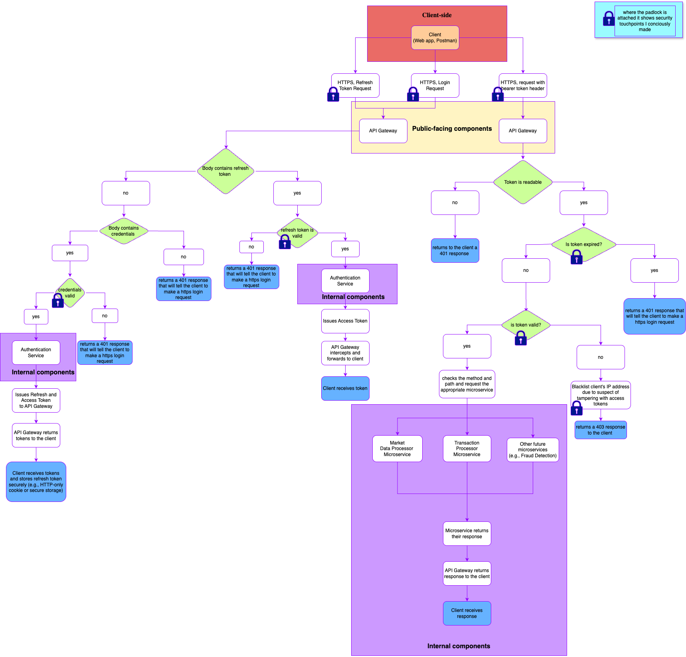

## 🔐 Authentication & Token Validation Flow

The API Gateway acts as the central access point for all client requests. It manages:

- Secure HTTPS communication from client-side apps.
- Token issuance requests forwarded to the Authentication Service.
- Access token validation and routing to internal microservices.
- Refresh token processing (securely handled over HTTPS).
- Rejection of malformed, expired, or tampered tokens.

This diagram illustrates the full authentication lifecycle, including how access and refresh tokens are processed, validated, and routed:

🛡️ All security-sensitive communication is encrypted using HTTPS, and refresh tokens are never exposed in URLs. Access tokens are expected to be sent via Bearer token in the `Authorization` header. Refresh tokens are recommended to be stored in `HttpOnly` secure cookies or passed in the request body over HTTPS.

> ℹ️ For security best practices and detailed architecture boundaries, see [docs/tradestream-prd.md](../docs/tradestream-prd.md).
