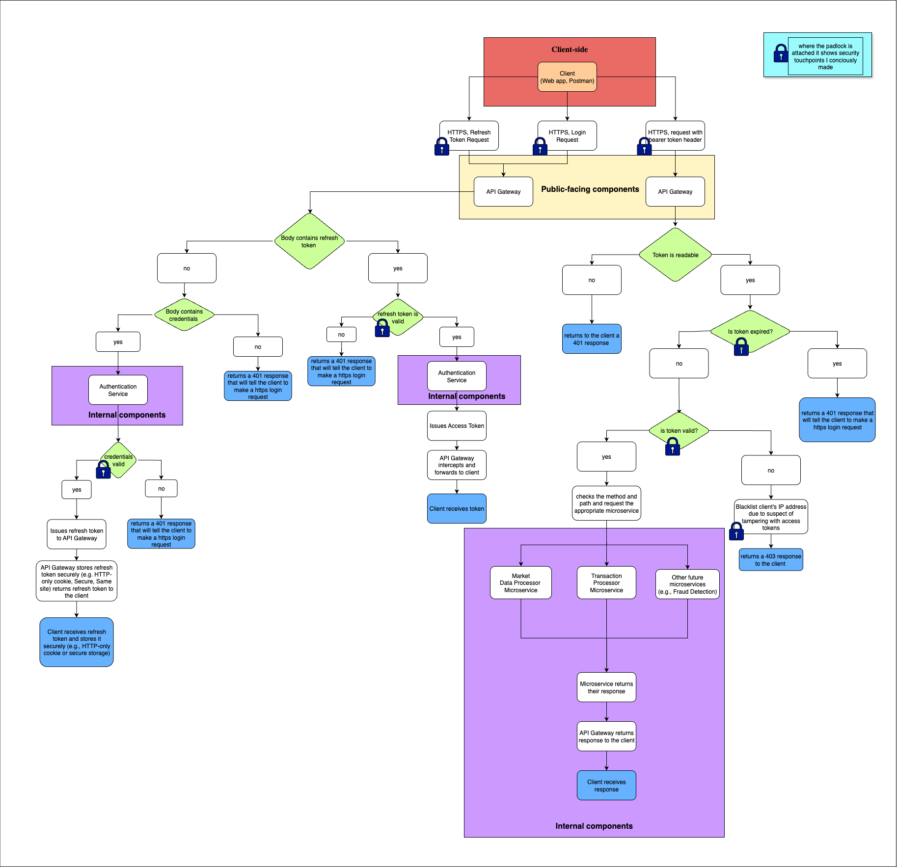

## API Gateway – Secure Request Routing & Token Validation

The **API Gateway** is the central gatekeeper for all client requests in the **TradeStream** platform. It enforces security at the edge, intercepts and verifies tokens, and routes valid requests to internal microservices.

---

### Core Responsibilities

* Terminates and enforces **HTTPS** for all incoming client requests.
* Forwards **login and refresh requests** to the Authentication Service.
* **Validates access tokens** (JWS) for protected routes.
* **Decrypts and verifies refresh tokens** (JWE with inner JWS) securely.
* Sets and reads refresh tokens via **Secure, SameSite, HttpOnly cookies**.
* Rejects expired, tampered, or unauthorized tokens with appropriate status codes.

---

### Token Handling Flow

#### Access Tokens (JWS)

* Received via the `Authorization` header as a **Bearer token**.
* Verified using the **RSA public key** (paired with the Authentication Service's private signing key).
* If valid, request is routed to the correct internal microservice.

#### Refresh Tokens (JWE)

* Received via secure HTTP-only cookie or body.
* **Decrypted using AES-256-GCM** with a randomly generated CEK.
* CEK is encrypted using the **API Gateway’s RSA public key**.
* Inner payload (JWS) is validated to ensure integrity before requesting a new access token.

---

### Security Practices

* All communication is **HTTPS only** — no token transmission over HTTP.
* Refresh tokens are **never sent via URL** (query string).
* **Access tokens are short-lived** and tamper-evident via signature checks.
* **Refresh tokens are doubly protected** through JWE + JWS wrapping.
* Security touchpoints are indicated in the architecture diagram via lock icons 🔒.

---

### Architecture Overview

---

### Key Concepts Reflected in Diagram

* **Authentication delegation**: API Gateway forwards login requests and token refresh requests to the Authentication Service.
* **Access control**: Only valid tokens allow access to downstream microservices (e.g., Market Data, Trade Executor).
* **Granular rejections**: Handles malformed, expired, or mismatched tokens with status codes like `401`, `403`.

---

> ℹ️ For security principles and architecture breakdown, see [docs/tradestream-prd.md](../docs/tradestream-prd.md).

---
