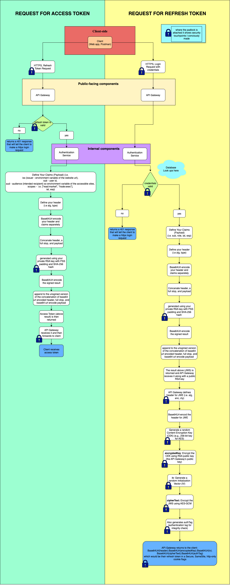

## 🛡️ Authentication Service

This microservice handles user authentication and secure token issuance in the **TradeStream** system. It generates **signed access tokens** and **encrypted refresh tokens**, using modern cryptographic standards to ensure confidentiality, integrity, and tamper-proof delivery across services.

---

### 📌 Responsibilities

* Verifies login credentials from users.
* Issues signed **access tokens** (JWS) for stateless, tamper-evident API authorization.
* Issues **encrypted refresh tokens** (JWE) for secure re-authentication.
* Signs tokens using **PS256 (RSA-PSS + SHA-256)** to avoid algorithm substitution attacks.
* Interfaces with the API Gateway, which handles token delivery and validation.

---

### 🔐 Security Highlights

* **Private RSA Key Usage**

  * The service uses a **private RSA key**, securely injected via environment variables, to sign all access tokens and refresh token inner payloads.

* **Refresh Token Encryption**

  * The API Gateway encrypts refresh tokens using **AES-256-GCM** and a **randomly generated CEK**, which is itself encrypted with the API Gateway’s **RSA public key**.

* **HTTPS Enforcement**

  * All client communication flows through HTTPS to ensure end-to-end security, especially for login and refresh flows.

---

### 📊 Architecture Diagram

 
<em>This diagram shows the full login and token issuance process used by the Authentication Service.</em>

---

### 🧠 How It Works

#### Login Flow:

1. Client sends login request with credentials over HTTPS.
2. If credentials are valid:

   * Access token is generated and signed (JWS using `PS256`).
   * Refresh token payload is also signed (JWS), then encrypted by the API Gateway (JWE).
   * Tokens are returned to the client via API Gateway.

#### Refresh Flow:

1. Client sends refresh token via HTTPS.
2. API Gateway decrypts it, validates the signature.
3. If valid, Authentication Service issues a new access token.

---

### 🔧 Configuration

* `PRIVATE_KEY`: RSA private key for signing.
* `JWT_EXPIRATION`: Access token expiration window.
* `JWT_ISSUER`, `JWT_AUDIENCE`: Used in the `iss` and `aud` claims.

---

### 🧪 TODO / Future Improvements

* Add unit and integration tests for token validation logic.
* Add metrics for login success/failure tracking.
* Rotate keys securely via KMS or secrets manager.

---
