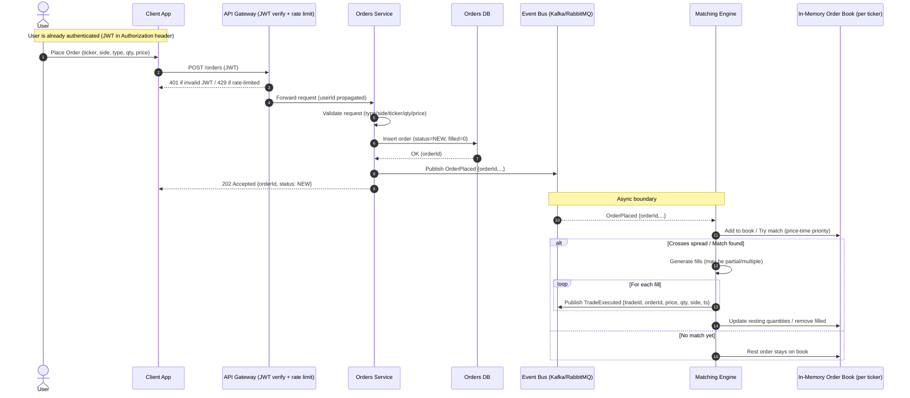

# Order Placement → Matching → Trade Execution

```mermaid
sequenceDiagram
    autonumber
    actor U as User
    participant C as Client App
    participant G as API Gateway (JWT verify + rate limit)
    participant O as Orders Service
    participant OBDB as Orders DB
    participant B as Event Bus (Kafka/RabbitMQ)
    participant ME as Matching Engine
    participant BOOK as In-Memory Order Book (per ticker)

    Note over U,C: User is already authenticated (JWT in Authorization header)

    U->>C: Place Order (ticker, side, type, qty, price)
    C->>G: POST /orders (JWT)
    G-->>C: 401 if invalid JWT / 429 if rate-limited
    G->>O: Forward request (userId propagated)

    O->>O: Validate request (type/side/ticker/qty/price)
    O->>OBDB: Insert order (status=NEW, filled=0)
    OBDB-->>O: OK (orderId)
    O->>B: Publish OrderPlaced {orderId,...}
    O-->>C: 202 Accepted {orderId, status: NEW}

    Note over B,ME: Async boundary

    B-->>ME: OrderPlaced {orderId,...}
    ME->>BOOK: Add to book / Try match (price-time priority)
    alt Crosses spread / Match found
        ME->>ME: Generate fills (may be partial/multiple)
        loop For each fill
            ME->>B: Publish TradeExecuted {tradeId, orderId, price, qty, side, ts}
        end
        ME->>BOOK: Update resting quantities / remove filled
    else No match yet
        ME->>BOOK: Rest order stays on book
    end
```

---
