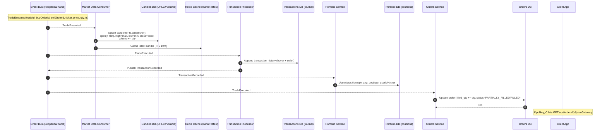

# Trade Execution → Market Data & Portfolio Updates (+ Order Status)

```mermaid 
sequenceDiagram
    autonumber
    participant B as Event Bus (Redpanda/Kafka)
    participant MD as Market Data Consumer
    participant CDB as Candles DB (OHLC+Volume)
    participant Q as Redis Cache (market latest)
    participant TP as Transaction Processor
    participant TXDB as Transactions DB (journal)
    participant PF as Portfolio Service
    participant PDB as Portfolio DB (positions)
    participant O as Orders Service
    participant OBDB as Orders DB
    participant C as Client App

    Note over B: TradeExecuted{tradeId, buyOrderId, sellOrderId, ticker, price, qty, ts}

    B-->>MD: TradeExecuted
    MD->>CDB: Upsert candle for ts.date(ticker):<br/>open(if first), high=max, low=min, close=price,<br/>volume += qty
    MD->>Q: Cache latest candle [TTL 10m]

    B-->>TP: TradeExecuted
    TP->>TXDB: Append transaction history (buyer + seller)
    TP-->>B: Publish TransactionRecorded

    B-->>PF: TransactionRecorded
    PF->>PDB: Upsert position (qty, avg_cost) per userId+ticker

    B-->>O: TradeExecuted
    O->>OBDB: Update order (filled_qty += qty, status=PARTIALLY_FILLED/FILLED)
    OBDB-->>O: OK
    Note over C: If polling, C hits GET /api/orders/{id} via Gateway
```

---
