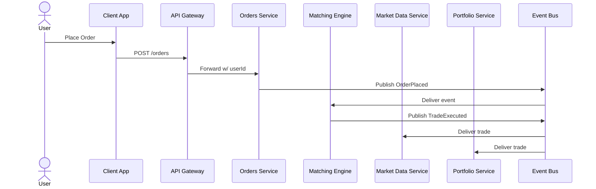

# **TradeStream — Event-Driven Trading Simulation Platform**

**Product Requirements & Technical Design Document**
**Version:** 2.0 (Upgraded Architecture)
**Author:** Nick Efe Oni
**Date:** 08 August 2025

---

## **Table of Contents**

* [1. Title & Document Control](#1-title--document-control)
* [2. Executive Summary](#2-executive-summary)
* [2A. Technology Overview](#2a-technology-overview)
* [3. Goals & Objectives](#3-goals--objectives)
* [4. Scope & Deliverables](#4-scope--deliverables)
* [5. High-Level Architecture](#5-high-level-architecture)
* [6. Technical Design](#6-technical-design)
* [7. Assumptions & Constraints](#7-assumptions--constraints)
* [8. Risks & Mitigations](#8-risks--mitigations)
* [9. Timeline & Milestones](#9-timeline--milestones)
* [10. Security Mapping](#10-security-mapping)
* [11. References & Resources](#11-references--resources)
* [12. Appendix](#12-appendix)

---

## **1. Title & Document Control**

| Field            | Content                                                |
| ---------------- | ------------------------------------------------------ |
| **Project Name** | TradeStream — Event-Driven Trading Simulation Platform |
| **Version**      | 2.0 (Upgraded Architecture)                            |
| **Author**       | Nick Efe Oni                                           |
| **Date**         | Fri, 08 August 2025                                    |
| **Reviewers**    | N/A                                                    |

---

## **2. Executive Summary**

**TradeStream** simulates a full securities trading lifecycle using an event-driven, microservice-based backend.

Key upgrades in v2.0:

* **Matching Engine Service** with per-ticker in-memory order books.
* **Asynchronous trade propagation** using Kafka/RabbitMQ.
* **OHLC and volume updates** driven by actual trades.
* **Redis-backed API Gateway** for caching and per-user rate-limiting.
* **JWS + JWE JWT authentication** for API security.

---

## **2A. Technology Overview**

| Category          | Technology                         | Purpose                            |
| ----------------- | ---------------------------------- | ---------------------------------- |
| Backend Framework | Java Spring Boot                   | Microservice APIs                  |
| Stream Processing | Kafka or RabbitMQ                  | Event-driven trade & order updates |
| Database          | PostgreSQL                         | Service-specific storage           |
| Cache Layer       | Redis                              | Caching quotes & rate-limiting     |
| Authentication    | JWS & JWE (JWT signed & encrypted) | Secure API auth                    |
| Containerization  | Docker & Docker Compose            | Deployment packaging               |
| CI/CD             | GitHub Actions                     | Build/test/deploy automation       |
| Deployment        | AWS Lightsail                      | Cloud hosting                      |

---

## **3. Goals & Objectives**

### Technical Goals

* Implement market/limit order placement.
* Realistic matching with price-time priority and partial fills.
* OHLC/volume updates from trade events.
* JWT + Redis rate-limiting in API Gateway.
* Deploy MVP on AWS Lightsail with Docker Compose.

### Learning Goals

* Deepen knowledge of event-driven architecture.
* Implement and optimize an order-matching algorithm.
* Apply production-grade JWT handling.

---

## **4. Scope & Deliverables**

### MVP Deliverables

* API Gateway with JWT validation & Redis rate-limiting.
* Auth & User Registration services.
* Orders Service.
* Matching Engine Service.
* Market Data Service.
* Portfolio Service.
* Kafka/RabbitMQ integration.
* PostgreSQL per service.

---

## **5. High-Level Architecture**

### Overview Flow



**Component Roles**

| Component           | Role                                       |
| ------------------- | ------------------------------------------ |
| API Gateway         | JWT verification, Redis caching/rate-limit |
| Orders Service      | Intake & store orders, emit events         |
| Matching Engine     | Match orders, emit trades                  |
| Market Data Service | Update OHLC & volume                       |
| Portfolio Service   | Update positions & transactions            |

---

## **6. Technical Design**

### 6.1 Event Models

#### `OrderPlaced` Schema

| Field       | Type     | Required | Notes                  |
| ----------- | -------- | -------- | ---------------------- |
| orderId     | UUID     | Yes      | Unique per order       |
| userId      | UUID     | Yes      | Authenticated user     |
| ticker      | String   | Yes      | Uppercase, max 5 chars |
| side        | Enum     | Yes      | BUY / SELL             |
| type        | Enum     | Yes      | MARKET / LIMIT         |
| price       | Decimal  | Yes      | > 0 if LIMIT           |
| quantity    | Integer  | Yes      | > 0                    |
| timeInForce | Enum     | Yes      | DAY / GTC              |
| timestamp   | ISO-8601 | Yes      | UTC                    |

#### `TradeExecuted` Schema

| Field     | Type     | Required | Notes             |
| --------- | -------- | -------- | ----------------- |
| tradeId   | UUID     | Yes      | Unique per trade  |
| orderId   | UUID     | Yes      | Originating order |
| userId    | UUID     | Yes      | Trade owner       |
| ticker    | String   | Yes      | Stock symbol      |
| price     | Decimal  | Yes      | Execution price   |
| quantity  | Integer  | Yes      | Filled amount     |
| side      | Enum     | Yes      | BUY / SELL        |
| timestamp | ISO-8601 | Yes      | UTC               |

---

### 6.2 Matching Engine Threading Model

* **Single-threaded per ticker** for MVP → avoids race conditions.
* Horizontal scaling possible by partitioning symbols across engine instances.

---

### 6.3 API Gateway Rate Limit Policy

| User Type     | Requests/sec | Burst | Notes                         |
| ------------- | ------------ | ----- | ----------------------------- |
| Authenticated | 50           | 100   | Per userId                    |
| Anonymous     | 0            | 0     | Blocked except login/register |

---

### 6.4 Deployment Topology

```mermaid
flowchart LR
  %% External
  User[Client / Browser\n(HTTPS)] -->|443/HTTPS| GW[(API Gateway\nJWT verify + Redis rate limit)]

  %% Lightsail host
  subgraph LS[AWS Lightsail VM (Docker Compose)]
    direction LR

    %% Edge/Gateway and cache
    GW --> RDS[(Redis\nCache + Rate Limiter)]

    %% Auth & user onboarding
    GW --> URS[User Registration Service]
    GW --> AUTH[Auth Service\n(JWS+JWE issuance)]
    AUTH ---|secrets| KPRIV[(jwt_private.pem)]
    AUTH ---|secrets| KPUB[(jwt_public.pem)]
    URS --> P_AUTH[(Postgres: authdb)]
    AUTH --> P_AUTH

    %% Orders & matching
    GW --> ORD[Orders Service]
    ORD --> P_ORD[(Postgres: ordersdb)]
    ORD --> BUS[(Kafka or RabbitMQ)]

    BUS --> ME[Matching Engine Service]
    ME -->|TradeExecuted| BUS

    %% Consumers
    BUS --> MDS[Market Data Service]
    BUS --> PFS[Portfolio Service]
    MDS --> P_MKT[(Postgres: marketdb)]
    PFS --> P_TX[(Postgres: transactiondb)]

    %% Optional real-time fanout later
    MDS -.optional.-> WS[(WebSocket/SSE Fanout)]
    ORD -.status updates.-> WS
    PFS -.portfolio updates.-> WS
  end

  %% Notes
  classDef pub fill:#eef,stroke:#88a,color:#000,stroke-width:1px;
  class GW pub
```

---

## **7. Assumptions & Constraints**

* Single Lightsail instance for MVP.
* Each service has its own DB schema.
* Event communication via Kafka/RabbitMQ only.

---

## **8. Risks & Mitigations**

| Risk                 | Mitigation           |
| -------------------- | -------------------- |
| Event loss           | Persistent queues    |
| Redis downtime       | Graceful degradation |
| Single-instance SPOF | K8s in Phase 4       |

---

## **9. Timeline & Milestones**

| Phase | Target   | Deliverables      | GitHub Epic |
| ----- | -------- | ----------------- | ----------- |
| 1     | Aug 2025 | Event bus MVP     | `#12`       |
| 2     | Sep 2025 | Orders + Matching | `#21`       |

---

## **10. Security Mapping**

* ASVS 2.1.1: JWT signature validation.
* ASVS 3.2.2: HttpOnly cookie for refresh token.

---
